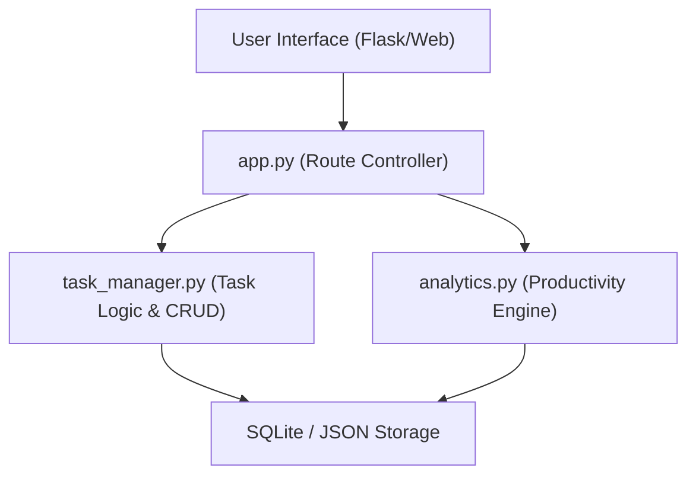

```mermaid
flowchart TD
    A["User Interface (Flask/Web)"]
    B["app.py (Route Controller)"]
    C["task_manager.py (Task Logic & CRUD)"]
    D["analytics.py (Productivity Engine)"]
    E["SQLite / JSON Storage"]

    A --> B
    B --> C
    B --> D
    C --> E
    D --> E
```
